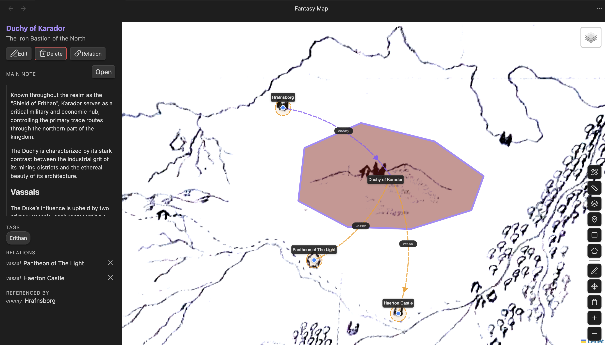

# Fantasy Map Plugin for Obsidian

An Obsidian plugin for displaying interactive fantasy campaign maps with markers, regions, and links to your vault notes.

## Features

### Maps

- Use any image from your vault as a map (world maps, dungeon layouts, city plans, etc.)
- Create multiple maps and switch between them via the map picker
- Link maps together in a hierarchy — attach a "local map" to any marker or region and drill down into it, with a back button to navigate up

### Markers and Regions

- Place **markers** (points of interest) anywhere on the map
- Draw **polygon regions** and **rectangles** to outline territories, forests, kingdoms, etc.
- Each feature (marker or region) supports:
  - **Name** and **description**
  - **Color** (for regions)
  - **Main note** — link to an Obsidian note; its content is rendered in a sidebar when selected
  - **Additional notes** — link multiple related vault notes for easy access
  - **Tags** — categorize features; clicking a tag searches your vault
  - **Relations** — connect features to each other with labeled relationships (e.g. "allied with", "trade route to"); displayed as curved arrows on the map.

### Layers

- Organize features (markers or regions) into named layers
- Toggle layer visibility using the built-in layer control

### Scale and Measurement

For when calculating distances matters in your campaign:

- **Set scale** by clicking two points on the map and entering the real-world distance between them
- A dynamic **scale bar** appears once scale is calibrated
- **Measure distance** between any two points using the ruler tool

## Usage

### Getting Started

1. Install the plugin in Obsidian.
2. Click the map icon in the ribbon or run the **"Fantasy Map: Create new map"** command.
3. Enter a name and select an image file from your vault.
4. Create a **layer** using the layers button in the bottom-right toolbar — you need at least one layer before adding features.

## FAQ

### What image formats are supported?

The plugin supports common image formats including png, jpeg, and webp. Make sure your map image is stored in your vault.

### Where are the map data and features stored?

Currently, the plugin uses Obsidian's plugin data storage to save map configurations,
layers, features, and their properties. This means all your map data is stored within your vault.

Storing the data in the vault allows for easy backup and portability,
especially for users who sync their vault across devices.

### Can I use this plugin for non-fantasy maps?

Sure! You just need an image-based map of any kind.
